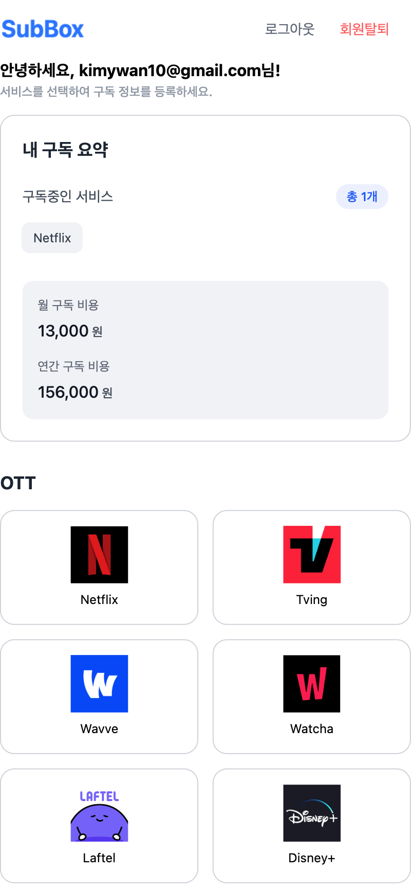

# SubBox - 개인 프로젝트

### 📝 프로젝트 소개

SubBox는 사용자들의 다양한 구독 서비스를 한눈에 관리할 수 있는 웹 서비스입니다. 여러 구독 서비스의 결제일과 비용을 쉽게 추적하고 관리할 수 있도록 도와줍니다.

## 주요 기능 소개

### 구독 서비스 등록

### 직접 입력

### 구독 목록 수정

### 반응형 UI

 

- 구독 목록 관리

  - 구독 서비스 등록/수정/삭제
  - 구독 서비스 직접 입력 후 등록
  - 월별/연간 구독 비용 요약 대시보드

- 결제 주기 관리

  - 다양한 결제 주기 (매주/2주마다/매월/매년)
  - 결제 주기별 다음 결제일 계산
  - 결제 주기에 따른 연간 총 비용 계산
  - 구독 시작일 기반 결제일
    - 미래 날짜: 첫 결제일은 구독 시작일
    - 현재 날짜: 다음 결제일은 한 주기 후
    - 과거 날짜: 현재 날짜 이후의 가장 가까운 결제일

- 사용자 인증
  - Google OAuth 소셜 로그인

 

## 기술 스택

- **Frontend**

  - React
  - TypeScript
  - Tailwind CSS

- **Backend**

  - Supabase (Authentication, Database)

- **Development Tools**
  - Vite
  - Git
  - GitHub
  - Vercel (배포)
